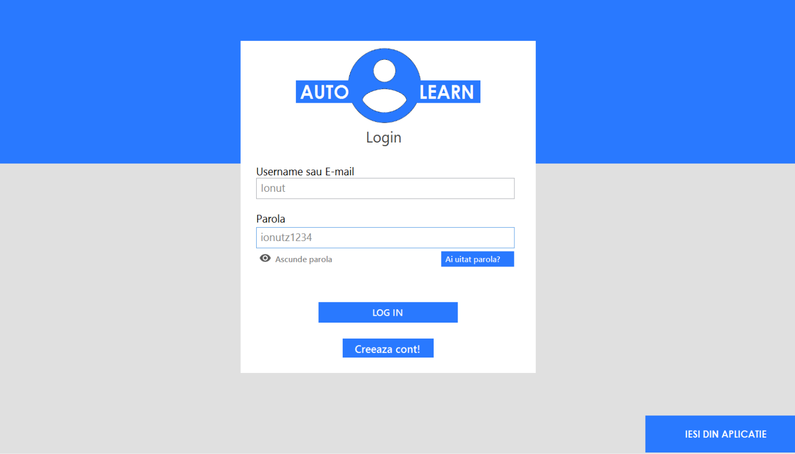
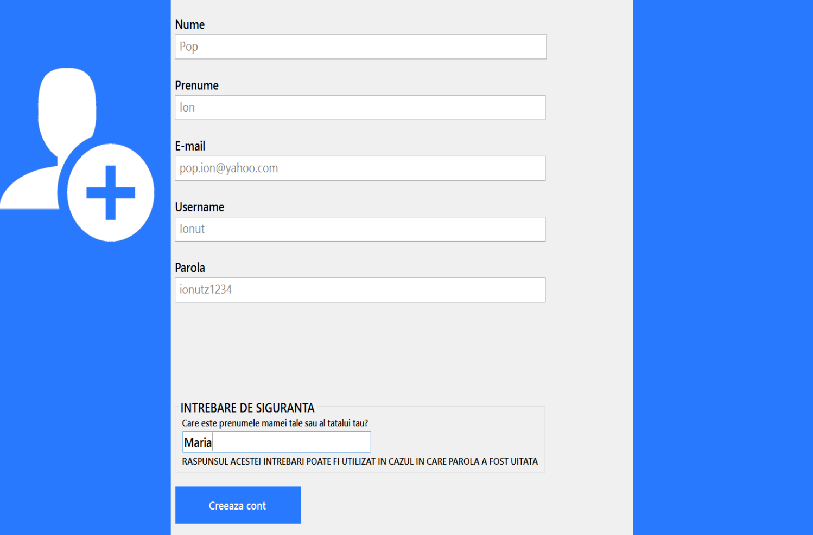
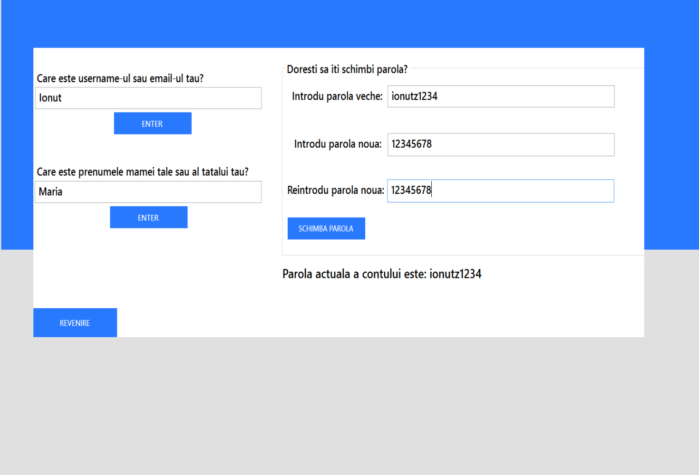
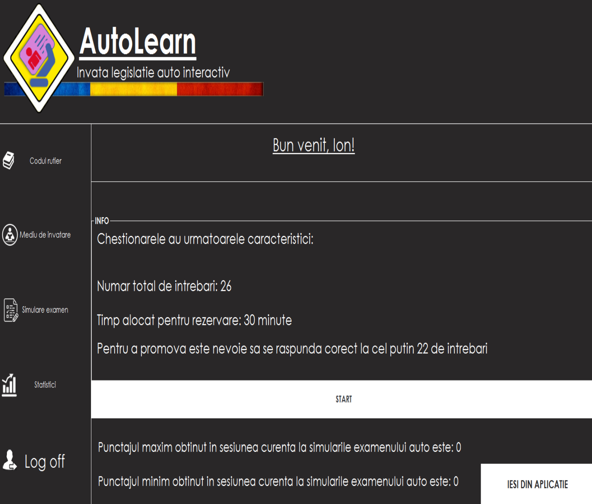
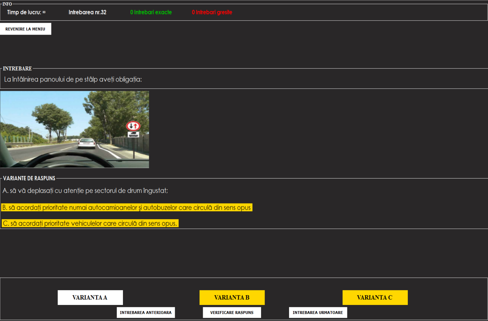
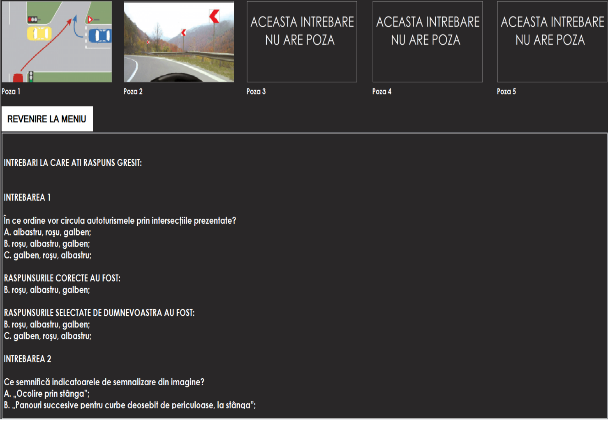
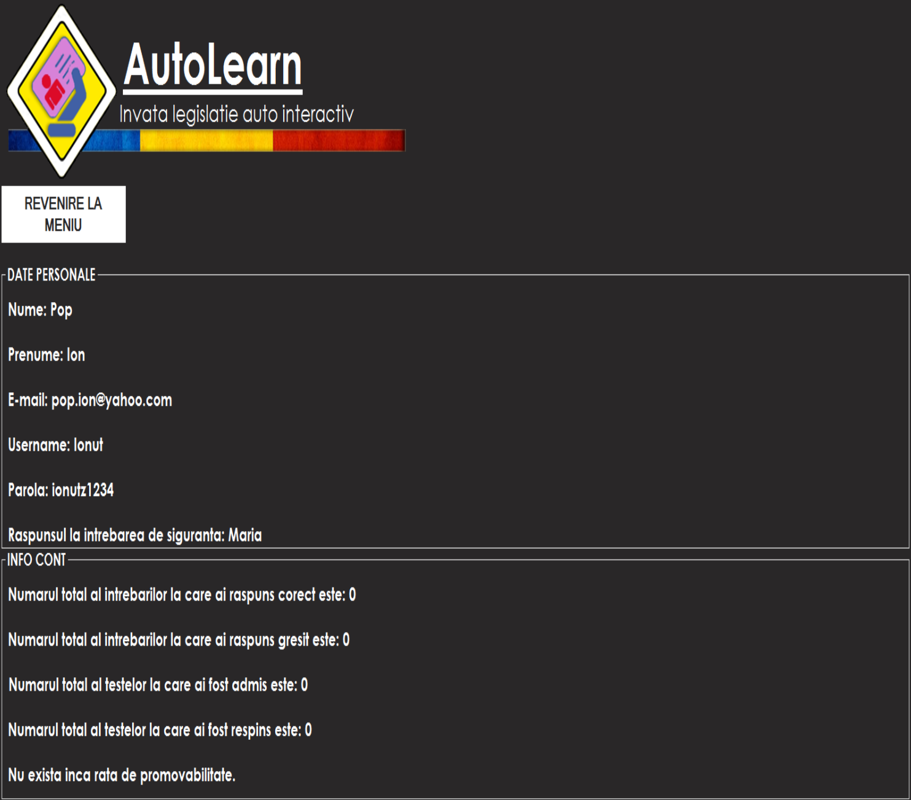

# AutoLearn - Atestat pentru clasa a 12-a
## Obiective
Simularea si pregatirea in cadrul examenului teoretic auto.

## Ideea de baza
AutoLearn este o aplicatie dezvoltata in C# folosind drept baza de date SQL Server pentru a stoca informatiile. Aplicatia este menita in a simula examenele auto teoretice si a stimula oamenii sa invete pentru acest examen pentru a preveni rata de esec. Utilizatorul are la dispozitie mai multe cazuri de utilizare si anume:

a) Functionalitatea de Login

b) Functionealitatea de Sign Up

c) Functionalitatea de recuperare a parolei

Dupa ce utilizatorul reuseste sa se logheze acesta este mutat pe meniul principal:

Aici, acesta are la dispozitie mai multe optiuni, precum:

a) Citirea legislatiei rutiere

b) Simularea de examen / Parcurgea mediului de invatare

c) Vizualizarea unui review in urma examenului / parcurgerea mediului de invatare

d) Vizualizarea unor statistici legate de performanta utilizatorului

